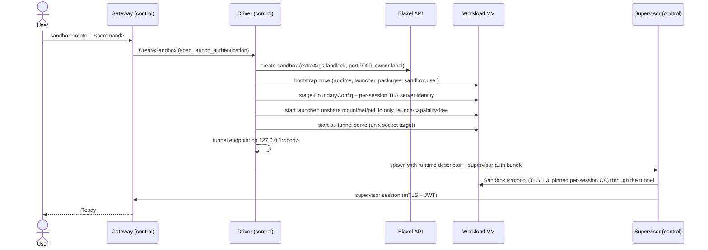

# Production guide: OpenShell on Blaxel

Use [README.md](README.md) for the shortest runnable path. This guide explains the design, the security model, and how to operate and debug it.

## System boundary

| Component | Where | Trust | Holds |
| --- | --- | --- | --- |
| `openshell` CLI | laptop | user | client certificate for the gateway |
| `os-tunnel dial` | laptop | user | the laptop's Blaxel credential, used for the ingress WebSocket |
| `openshell-gateway` (main) | control sandbox | trusted | PKI, gateway JWT signing key, sandbox records, policies, provider credentials |
| `openshell-driver-blaxel` | control sandbox | trusted | the Blaxel service-account key (root-only `driver.env`) |
| `openshell-supervisor` (one per sandbox) | control sandbox | trusted | gateway session JWT, policy engine, egress proxy, provider injection |
| CLAT (`tayga`) + DoH forwarder | control sandbox | trusted | none |
| `os-tunnel serve` | workload sandbox | trusted plumbing | none |
| `openshell-sandbox` | workload sandbox | trusted runtime, capability-free | per-session TLS server key (read, then deleted) |
| agent | workload sandbox | untrusted | nothing |

The workload VM holds no credential that reaches Blaxel, the gateway or a provider. Blaxel's own `sandbox-api` still runs as root in the VM: it is the platform's control channel and the driver's trusted cleanup path.

## Request lifecycle



The gateway declares `Ready` when the supervisor session attaches, not when the driver says so (`driver_reports_runtime_readiness = false`). A fresh workload reaches `Ready` in about 15 s.

## The OpenShell main contract, as this driver implements it

- **Launch credentials.** `launch_authentication` is split as the contract requires:
  - the supervisor gets the `supervisor` bundle verbatim (JWTs), in a 0600 file;
  - the sandbox gets only the session identity and the gateway's verification keys, in `BoundaryConfig`.

  No JWT reaches the workload.
- **Per-session TLS.** An Ed25519 CA signs one leaf for `sandbox.<session_id>.openshell.internal`, then the CA key is discarded. The supervisor pins the CA, and the sandbox deletes the key after loading it.
- **Workload identity.** uid/gid 1500, no supplementary groups. `launch-capability-free` drops to it and clears every capability.
- **Outer fence.** The launcher runs `openshell-sandbox` as PID 1 of new mount, network and PID namespaces. The network namespace only has `lo`. The driver asserts OpenShell's four fence guarantees, `default_deny_egress`, `no_unmanaged_egress_path`, `revocation_verified` and `controller_loss_fails_closed`, with a digest over that evidence.
- **Generations.** A sandbox pins its first supervisor. Stop kills both sides. Start (fresh credentials, same `runtime_generation`) restages everything and relaunches both.
- **Capabilities.** The driver negotiates protocol 1.x with `openshell.compute.contract` and returns the gateway's default resource-admission acknowledgement byte for byte.

Wire formats live in `driver/internal/boundary`. They are unit-tested and were validated against the real `openshell-sandbox` and `openshell-supervisor` binaries.

## Networking on Blaxel

Blaxel sandboxes are IPv6-only with NAT64/DNS64, and only HTTPS (port 443) leaves the platform. Two consequences:

1. **Ingress is WebSocket only.** Blaxel's preview proxy speaks HTTP/1.1 to workloads, so gRPC can't be exposed directly.
   - The CLI reaches the gateway through `os-tunnel dial` → `/port/9000/tunnel` → the gateway.
   - The supervisor reaches each sandbox through a tunnel the driver dials into the workload's `/port/9000`.

   Both tunnels multiplex streams with yamux and keep TLS end to end.
2. **Supervisor egress needs IPv4.** OpenShell main's mediated policy DNS answers AAAA queries empty and resolves A records only. The fix is in review upstream, in [NVIDIA/OpenShell#3702](https://github.com/NVIDIA/OpenShell/pull/3702). The control sandbox therefore runs:
   - a **CLAT**: `tayga` translates IPv4 to IPv6 through the NAT64 prefix, which `clat.sh` discovers from `ipv4only.arpa` (RFC 7050). Translated packets leave through the VM's single IPv6 address via MASQUERADE;
   - a **DNS-over-HTTPS forwarder**: `os-tunnel dns` on `127.0.0.2:53`, first in `/etc/resolv.conf`. It relays queries to Cloudflare's DoH endpoint over IPv6, because classic DNS to public resolvers doesn't leave Blaxel.

Workload sandboxes are unaffected: they have no network interface besides loopback.

## Configuration

`gw/env.sh` reads `.env` (see [.env.example](.env.example)). The important values:

| Variable | Default | Purpose |
| --- | --- | --- |
| `BL_WORKSPACE`, `BL_ENV`, `BL_REGION` | `charlou-dev`, `dev`, `us-was-1` | Where the control and workload sandboxes run |
| `BL_API_KEY` | none | Service-account key given to the driver. Required by `make deploy` |
| `CONTROL_SANDBOX` | `os-control` | Control sandbox name |
| `GATEWAY_NAME` | `blaxel-main` | CLI gateway name and driver owner label |
| `LOCAL_PORT` | `17690` | Laptop port for the CLI |

Driver flags, set by `os-deploy`:
- `-kernel-variant` (default `landlock`);
- `-packages` (installed as root at bootstrap);
- `-install-claude`;
- `-image` (default `blaxel/py-app:latest`);
- `-memory`;
- `-log-level`.

## Security boundaries

- The agent has no route out: its namespace only has loopback, and every TCP open and DNS query is mediated by `openshell-sandbox` and decided by the supervisor.
- The agent runs capability-free under Landlock ABI v7 and seccomp. OpenShell's own qualification (`capability-probe-launch 1500 1500`) passes on the `landlock` kernel.
- The service-account key only exists in the control sandbox, in a root-only file sourced by the driver process. The gateway is started with it unset.
- Each control plane only manages sandboxes labeled with its owner (`openshell.ai/driver-owner`). Recovery, `status` and `cleanup --orphans` never touch another control plane's sandboxes.
- Launch environment from the user can't override `OPENSHELL_*` names. It goes to the workload only (`child_env`).
- Known gap in OpenShell main: the SSRF checks don't look inside NAT64 prefixes, so a DNS64 answer that wraps a private IPv4 address passes the public-only check for wildcard hosts. [NVIDIA/OpenShell#3702](https://github.com/NVIDIA/OpenShell/pull/3702) fixes it (NAT64 addresses are checked as their embedded IPv4 address, with `nat64_prefixes` for network-specific prefixes). Until it's merged, keep wildcard policies narrow on NAT64 hosts.

## Operations

```bash
make status                     # control-plane processes, gateway, sandbox mapping
make os ARGS='logs <name>'      # sandbox + gateway logs, OCSF decisions
./gw/cleanup.sh <name>          # exact plan; --apply to execute
./gw/cleanup.sh --orphans       # this control plane's VMs unknown to the gateway
make deploy                     # redeploy (restarts gateway, driver, supervisors)
```

On the control sandbox:
- process logs are available through `bl logs sandbox os-control <process>`, with processes `os-driver`, `os-gateway`, `os-ingress`, `os-clat` and `os-dns`;
- supervisor logs are in `/var/lib/openshell-blaxel/<sandbox-id>/gen-*/supervisor.err.log`.

For a workload VM that never boots, read the Firecracker guest console (in Blaxel's SigNoz: `service.name = 'firecracker-vm'`, filtered by `instance_id`).

## Failure handling

Every row was observed while building this.

| Signal | Meaning | Action |
| --- | --- | --- |
| `DENIED <host>:53 [reason:policy_dns_upstream_no_data]` | Supervisor has no IPv4 DNS path | Check `os-clat` and `os-dns` are running and `127.0.0.2` is first in the control sandbox's `resolv.conf` |
| IPv4 connect `Network is unreachable` in the control sandbox | CLAT down | Redeploy, or `sh /var/lib/openshell/clat.sh install` and restart `os-clat` |
| Workload stuck `Provisioning`, `WORKLOAD_UNAVAILABLE`, no logs | The VM doesn't boot | Read the Firecracker console. One `landlock` build panicked with `FIPS140 loader: module loading error` |
| `Landlock allow/deny probe` failure | Kernel without Landlock ABI ≥ 3 | Workloads need `extraArgs: {landlock: enabled}` (docs/KERNEL.md) |
| `SSH server failed during startup: path must be shorter than SUN_LEN` | Socket path over 108 bytes | Fixed: SSH sockets live under `/run/openshell-blaxel/<hash>/` |
| `failed to parse sandbox policy YAML` right after `policy get --base` | No trailing newline in that output | Add a newline before appending YAML |
| `text file busy` on deploy | Binaries still running | `os-deploy` stops the control-plane processes before uploading |
| Deploy hangs on a `TERMINATED` control sandbox | Blaxel keeps deleted sandboxes listed | `os-deploy` creates over the name, which revives it as a new sandbox |
| Sandbox killed ~10 min after start | keepAlive process started without `timeout: 0` | Use `blaxel.Forever` for long-lived processes |
| Your sandboxes show as orphans | `GATEWAY_NAME` doesn't match their owner label | Fix `.env`. Never run `cleanup --orphans --apply` without reading the plan |

## Verification ladder

1. `make test`: unit tests (wire formats, TLS handshake, tunnel, DoH forwarder, driver helpers) and script syntax.
2. `experiments/kab.mjs` and `experiments/wl-netns.mjs`: the `landlock` kernel boots, and OpenShell's runtime qualifies inside an empty netns.
3. `make deploy && make connect && make status`.
4. `make e2e`: 20 checks against real sandboxes.
5. `./gw/cleanup.sh --orphans`: nothing to clean up.

## Teardown

- Delete workload sandboxes through OpenShell (`./gw/cleanup.sh <name> --apply`).
- `make destroy` deletes the control sandbox and stops the laptop tunnel.
- Delete throwaway providers first if you created some. They live in the gateway's database inside the control sandbox and go away with it.

## Primary references

- [OpenShell](https://github.com/NVIDIA/OpenShell), [RFC 0012: isolation backend](https://github.com/NVIDIA/OpenShell/tree/main/rfc/0012-isolation-backend), [PR #3366](https://github.com/NVIDIA/OpenShell/pull/3366), [#2712 policy DNS](https://github.com/NVIDIA/OpenShell/issues/2712)
- [Blaxel sandboxes](https://docs.blaxel.ai/Sandboxes/Overview), [processes](https://docs.blaxel.ai/Sandboxes/Processes), [ports](https://docs.blaxel.ai/Sandboxes/Ports)
- [RFC 7050: NAT64 prefix discovery](https://www.rfc-editor.org/rfc/rfc7050), [RFC 8484: DNS over HTTPS](https://www.rfc-editor.org/rfc/rfc8484), [Landlock](https://docs.kernel.org/userspace-api/landlock.html)
