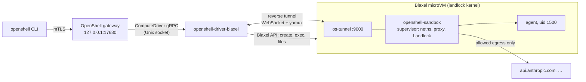

# OpenShell on Blaxel

NVIDIA [OpenShell](https://github.com/NVIDIA/OpenShell) is a policy runtime for autonomous agents. It confines an agent's network egress to named binaries and hosts, inspects HTTP at L7, injects credentials the agent never sees, and restricts the filesystem with Landlock.

This repository runs OpenShell sandboxes as Blaxel microVMs. An external OpenShell compute driver creates one Blaxel sandbox per OpenShell sandbox. OpenShell's supervisor runs inside it and enforces the policy. You keep the `openshell` CLI and its policies and gain Blaxel's fast-booting, standby-capable VMs. It also includes Claude Code, an end-to-end suite, and exact cleanup.



## What you get

| Default | Value |
| --- | --- |
| Compute | One Blaxel mk3 microVM per OpenShell sandbox |
| Kernel | `landlock` variant (Linux 6.18, Landlock ABI v7) via `extraArgs` |
| Workload identity | uid 1500 `sandbox`, no capabilities, no `sudo` |
| Network | Deny by default, per-binary host allowlist, L7 REST rules, OCSF audit log |
| Filesystem | Landlock: write only to `/sandbox` (`$HOME`) and `/tmp` |
| Credentials | Provider placeholders in the workload, real keys injected by the egress proxy |
| Gateway link | Reverse tunnel dialed by the driver. The VM holds no Blaxel credentials |
| Agents | Claude Code preinstalled at the path OpenShell's provider profile trusts |
| Cleanup | Plan first, `--apply` required |

The end-to-end suite creates a real sandbox and checks every layer (excerpt of a real run):

```text
== 2. create sandbox e2e-115802
  PASS  Ready after 16s
  PASS  Blaxel sandbox exists: os-e2e-115802-e3e7a546
== 3. exec
  PASS  exec runs as non-root sandbox user
== 4. network policy
  PASS  direct egress blocked
  PASS  unlisted host denied by default policy
  PASS  policy update loaded by in-VM supervisor
  PASS  allowed host reachable through the policy proxy
  PASS  L7 read-only blocks POST
  PASS  denial recorded in OCSF logs
== 5. filesystem
  PASS  runs on the Blaxel Landlock kernel
  PASS  Landlock denies world-writable path outside policy
== 6. stop / start
  PASS  workspace preserved across stop/start
== 7. delete
  PASS  Blaxel sandbox deleted

RESULT: 22 passed, 0 failed
```

## Start here

You need:
- a Blaxel workspace with the `landlock` kernel variant, and the `bl` CLI from [blaxel-ai/toolkit](https://github.com/blaxel-ai/toolkit) (`brew install blaxel-ai/blaxel/blaxel`), logged in with `bl login <workspace>`;
- Go 1.25+ and `gh` (to fetch the OpenShell runtime);
- OpenShell **v0.0.116**, installed with `brew install nvidia/openshell/openshell`.

```bash
git clone git@github.com:blaxel-ai/openshell-blaxel.git && cd openshell-blaxel
cp .env.example .env          # workspace, env, region; no secrets
make setup                    # gateway PKI + CLI gateway "blaxel" (once)
make up                       # fetch runtime, build, start driver + gateway, configure
```

`make up` downloads the `openshell-sandbox` runtime from NVIDIA's v0.0.116 release and verifies its checksum. It builds the driver and `os-tunnel`, then starts the driver and a gateway on `127.0.0.1:17680`. Finally it enables provider profiles and imports the Claude Code profile.

## Prove each layer

Check that the kernel qualifies before you trust the sandbox:

```bash
cd experiments && npm ci && set -a && . ../.env && set +a
node kab.mjs                  # default vs landlock kernel boot, side by side
```

Then run the full path against real Blaxel sandboxes:

```bash
make e2e                      # ~3 min, creates and deletes one sandbox
```

A valid run has all three results:

- `RESULT: 22 passed, 0 failed`.
- A matching `os-<name>-<hash>` Blaxel sandbox during the run (`make status`).
- `DENIED` entries in `openshell -g blaxel logs <name>` for the blocked requests.

## Try the useful examples

### Interactive sandbox

```bash
openshell -g blaxel sandbox create --name dev --no-tty -- sleep infinity
openshell -g blaxel sandbox exec -n dev --tty -- bash -l
```

The command after `--` is the sandbox's main process. `sleep infinity` keeps the sandbox alive while shells come and go.

### Claude Code

```bash
read -s "ANTHROPIC_API_KEY?Anthropic API key: " && export ANTHROPIC_API_KEY
openshell -g blaxel provider create --name my-claude --type claude-code-blaxel --from-existing
unset ANTHROPIC_API_KEY

openshell -g blaxel sandbox create --name claude --provider my-claude -- claude
```

Claude reaches `api.anthropic.com` only as `/usr/local/bin/claude`. The same host from `curl` is denied. The workload only sees a placeholder key, never the real one. See [docs/CLAUDE-CODE.md](docs/CLAUDE-CODE.md).

### Allow one host, read-only, for one binary

```bash
openshell -g blaxel policy get dev --base | sed -n '/^---$/,$p' | sed 1d > /tmp/dev.yaml
cat >> /tmp/dev.yaml <<'EOF'
network_policies:
  github:
    name: github-readonly
    endpoints:
      - { host: api.github.com, port: 443, protocol: rest, enforcement: enforce, access: read-only }
    binaries:
      - { path: /usr/bin/curl }
EOF
openshell -g blaxel policy set dev --policy /tmp/dev.yaml --wait
```

`curl https://api.github.com/zen` now works. `curl -X POST …` returns a structured `policy_denied` from the L7 proxy, and any other host still gets a 403. A live sandbox can't drop filesystem paths, which is why the base policy is kept.

### Landlock in action

```bash
openshell -g blaxel sandbox exec -n dev -- sh -c 'touch /var/tmp/x; touch /tmp/x && echo tmp-ok'
```

`/var/tmp` is world-writable, yet the write is denied. Landlock is the only thing stopping it.

## Operate it

```bash
make status                                  # gateway, driver, providers, OpenShell <-> Blaxel mapping
openshell -g blaxel logs <name>              # OCSF audit trail: ALLOWED / DENIED with binary and host
./gw/cleanup.sh <name>                       # exact plan
./gw/cleanup.sh <name> --apply               # apply it
./gw/cleanup.sh --orphans                    # Blaxel sandboxes the gateway no longer knows
```

`make status` shows each sandbox's phase, Blaxel status and kernel variant. It flags orphans on either side.

`gw/restart.sh` restarts the driver and gateway together. It keeps Blaxel sandboxes and their workloads running and re-attaches tunnels, but **it drops every open terminal session**, so warn users first.

## Production guardrails

- The workload runs as uid 1500 with zero capabilities under Landlock, seccomp and a network namespace. Its only route out is the supervisor's policy proxy.
- The driver talks to Blaxel through the official Go SDK ([`sdk-go`](https://github.com/blaxel-ai/sdk-go), the SDK behind `bl` in [blaxel-ai/toolkit](https://github.com/blaxel-ai/toolkit)). It authenticates exactly like `bl`: `BL_API_KEY`, or the `bl login` session with automatic refresh.
- The VM never holds Blaxel credentials. The driver dials the tunnel in, and the in-VM endpoint drops connections until the driver attaches.
- Every sandbox is labeled with its driver instance (`openshell.ai/driver-owner`). Recovery, `status` and `cleanup` only touch their own instance, so several gateways can share a workspace.
- The gateway's mTLS runs end to end inside the tunnel, so Blaxel's edge only sees opaque bytes.
- Provider keys stay in the gateway. The workload gets placeholders, and the proxy injects the real header on allowed requests only.
- User environment can't override driver-owned `OPENSHELL_*` variables. Values are shell-quoted, and invalid names are dropped (unit-tested).
- Long-lived Blaxel processes use `keepAlive: true, timeout: 0`. The API default would kill them at 600 s.
- Driver restarts rebuild state from Blaxel labels and re-attach without restarting workloads.

This is **OpenShell v0.0.116**. There the supervisor runs as root inside the VM with the gateway client certificate and the sandbox JWT. OpenShell `main` moves the supervisor out of the workload VM. See [docs/ROADMAP.md](docs/ROADMAP.md).

Read [GUIDE.md](GUIDE.md) for the design, security boundaries, failure handling and teardown. Read [.env.example](.env.example) for every setting and [AGENTS.md](AGENTS.md) if an AI agent will work in this repo.

## Verify locally

```bash
make test                     # unit tests + script syntax, no network
make build
```

CI runs formatting, vet, `go test -race`, cross-builds and a script syntax check on every push ([.github/workflows/verify.yml](.github/workflows/verify.yml)).

## Current upstream contract

This repository targets:

- OpenShell **v0.0.116** compute-driver protocol (`openshell.compute.v1`, [driver/proto](driver/proto)), gateway, CLI and `openshell-sandbox` runtime.
- Blaxel Go SDK [`github.com/blaxel-ai/sdk-go`](https://github.com/blaxel-ai/sdk-go) **v0.27.2** (the version used by [blaxel-ai/toolkit](https://github.com/blaxel-ai/toolkit)), sandbox generation `mk3`, kernel variant `landlock` (`spec.runtime.extraArgs`).
- Claude Code 2.1.x (installed at bootstrap), with the `claude-code-blaxel` provider profile.

Primary references: [OpenShell](https://github.com/NVIDIA/OpenShell), [OpenShell providers](https://github.com/NVIDIA/OpenShell/blob/main/docs/sandboxes/manage-providers.mdx), [RFC 0012: isolation backends](https://github.com/NVIDIA/OpenShell/tree/main/rfc/0012-isolation-backend), [Blaxel sandboxes](https://docs.blaxel.ai/Sandboxes/Overview), [Blaxel processes](https://docs.blaxel.ai/Sandboxes/Processes), [Landlock](https://docs.kernel.org/userspace-api/landlock.html).
