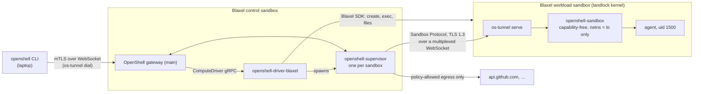

# OpenShell on Blaxel

NVIDIA [OpenShell](https://github.com/NVIDIA/OpenShell) is a policy runtime for autonomous agents. It confines an agent's network egress to named binaries and hosts, inspects HTTP at L7, injects credentials the agent never sees, and restricts the filesystem with Landlock.

This repository runs OpenShell **main** entirely on Blaxel. A control sandbox hosts the OpenShell gateway, this repository's compute driver, and one OpenShell supervisor per agent. Every agent gets its own Blaxel microVM, where OpenShell's sandbox runtime confines it. Your laptop only runs the `openshell` CLI.



## What you get

| | |
| --- | --- |
| OpenShell | `main` (the `dev` release, RFC 0012 isolation contract) |
| Placement | Gateway, driver and supervisors in a Blaxel control sandbox. Each agent in its own Blaxel microVM |
| Workload kernel | `landlock` variant (Linux 6.18, Landlock ABI v7). OpenShell's runtime qualification passes |
| Outer fence | The agent's network namespace only has loopback. All egress is mediated by the supervisor |
| Workload identity | uid 1500, zero capabilities, `no_new_privs`, Landlock, seccomp |
| Credentials | None in the workload VM: no Blaxel key, no gateway key, no provider key |
| Policy | Per-binary host rules, L7 REST rules, OCSF audit log |
| Laptop | The CLI plus a WebSocket tunnel |

The end-to-end suite runs against real Blaxel sandboxes:

```text
== 1. control plane on Blaxel      gateway main (mTLS) · blaxel driver negotiated
== 2. create sandbox               Ready after 15s (supervisor session attached)
== 3. isolation                    uid 1500 · landlock kernel · netns has only loopback
                                   raw egress blocked · Landlock denies /var/tmp
                                   driver state and credentials hidden from the workload
== 4. network policy               unlisted host denied · policy update loaded
                                   allowed host reachable through the supervisor proxy
                                   L7 read-only blocks POST · denials in the audit log
== 5. stop / start                 new generation, fresh launch credentials, workspace kept
== 6. delete                       gone
RESULT: 20 passed, 0 failed
```

## Start here

You need:
- a Blaxel workspace with the `landlock`, `tun` and `iptables` kernel variants;
- a service-account API key for it;
- the `bl` CLI from [blaxel-ai/toolkit](https://github.com/blaxel-ai/toolkit), logged in;
- Go 1.25+ and `gh`.

```bash
git clone git@github.com:blaxel-ai/openshell-blaxel.git && cd openshell-blaxel
cp .env.example .env        # set BL_WORKSPACE, BL_ENV, BL_REGION and BL_API_KEY
make deploy                 # fetch OpenShell main, build, create the control sandbox
make connect                # laptop tunnel + CLI registration
make e2e                    # ~4 min, creates and deletes one workload sandbox
```

`make deploy` downloads OpenShell main from NVIDIA's `dev` release and checks the checksums. It builds the driver and tunnel, then creates the control sandbox. There it generates the gateway PKI, starts the gateway, driver, ingress tunnel, CLAT and DNS forwarder, and fetches the CLI client bundle to `~/.openshell-blaxel/mtls`. Running it again updates the binaries in place.

## Use it

```bash
make os ARGS='sandbox create --name dev --no-tty -- sleep infinity'
make os ARGS='sandbox exec -n dev --tty -- bash -l'
make os ARGS='logs dev'                      # OCSF allow/deny audit trail
make os ARGS='sandbox delete dev'
```

`make os` runs the OpenShell main CLI with its own config directory, so an existing OpenShell install on your laptop is left alone. The command after `--` is the sandbox's main process. `sleep infinity` keeps the sandbox alive while shells come and go.

### Allow one host, read-only, for one binary

```bash
make os ARGS='policy get dev --base' | sed -n '/^---$/,$p' | sed 1d > /tmp/dev.yaml
cat >> /tmp/dev.yaml <<'EOF'

network_policies:
  github:
    name: github-readonly
    endpoints:
      - host: api.github.com
        port: 443
        protocol: rest
        enforcement: enforce
        access: read-only
    binaries:
      - path: /usr/bin/curl
EOF
make os ARGS='policy set dev --policy /tmp/dev.yaml --wait'
```

`curl https://api.github.com/zen` now works from the sandbox. A `POST` is denied at L7, and any other host doesn't even resolve. OpenShell main's `policy get --base` output has no trailing newline, hence the extra blank line.

## Operate it

```bash
make status                    # control-plane processes, gateway, OpenShell <-> Blaxel mapping
./gw/cleanup.sh <name>         # exact plan; --apply to execute
./gw/cleanup.sh --orphans      # Blaxel sandboxes this control plane no longer knows
make destroy                   # delete the control sandbox
```

Redeploying (`make deploy`) restarts the gateway and driver. A sandbox pins its first supervisor, so a sandbox that was running needs a new generation. If it shows `Stopped` afterwards, start it with `make os ARGS='sandbox start <name>'`; its workspace is kept.

## Blaxel-specific pieces

- **Kernel variants.** Workloads use `extraArgs: {landlock: enabled}`, because OpenShell main requires Landlock ABI ≥ 3. The control sandbox uses `{tun, iptables}` for the CLAT.
- **IPv4 egress for the supervisor.** Blaxel sandboxes are IPv6-only with NAT64/DNS64, and only HTTPS leaves the platform. OpenShell main's policy DNS resolves A records only, so the control sandbox runs:
  - a 464XLAT CLAT (`tayga`), using the NAT64 prefix discovered through `ipv4only.arpa`;
  - a DNS-over-HTTPS forwarder (`os-tunnel dns`) as its first resolver.

  The upstream fix, [NVIDIA/OpenShell `feat/policy-dns-ipv6-egress`](https://github.com/Joffref/OpenShell/tree/feat/policy-dns-ipv6-egress), makes the CLAT unnecessary.
- **Ingress.** Blaxel only exposes HTTPS/WebSocket (`/port/N`), so the CLI and the Sandbox Protocol both ride multiplexed WebSockets. TLS stays end to end inside them.

Read [GUIDE.md](GUIDE.md) for the design, security boundaries, failure handling and teardown, and [AGENTS.md](AGENTS.md) if an AI agent will work in this repo.

## Current contract

- OpenShell main at `08548713c` (`dev` release `0.0.117-dev.281`): compute-driver protocol `openshell.compute.v1` with extension negotiation, `openshell-sandbox` runtime, `openshell-supervisor`.
- Blaxel Go SDK [`github.com/blaxel-ai/sdk-go`](https://github.com/blaxel-ai/sdk-go) v0.27.2 (as used by `bl`), sandbox generation `mk3`.
- The OpenShell v0.0.116 integration (supervisor inside the VM, local gateway) is on tag [`openshell-v0.0.116`](https://github.com/blaxel-ai/openshell-blaxel/tree/openshell-v0.0.116).
